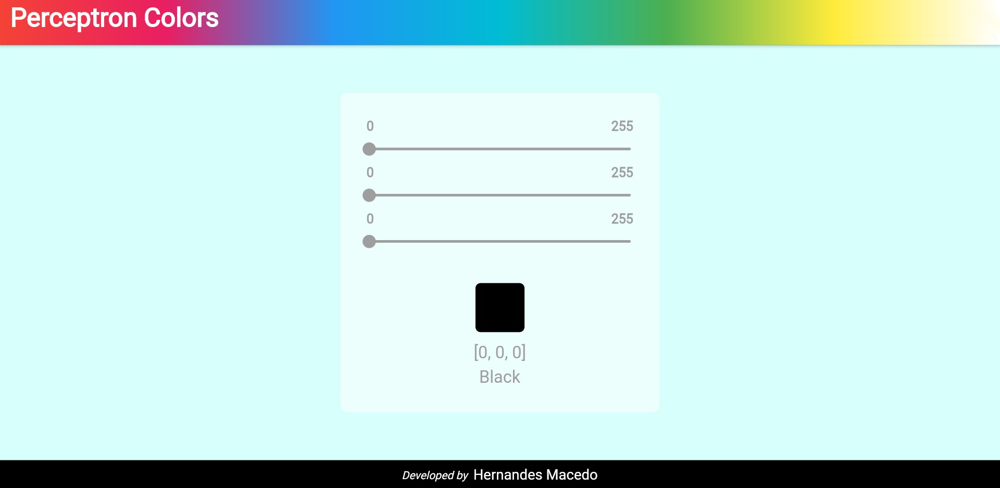
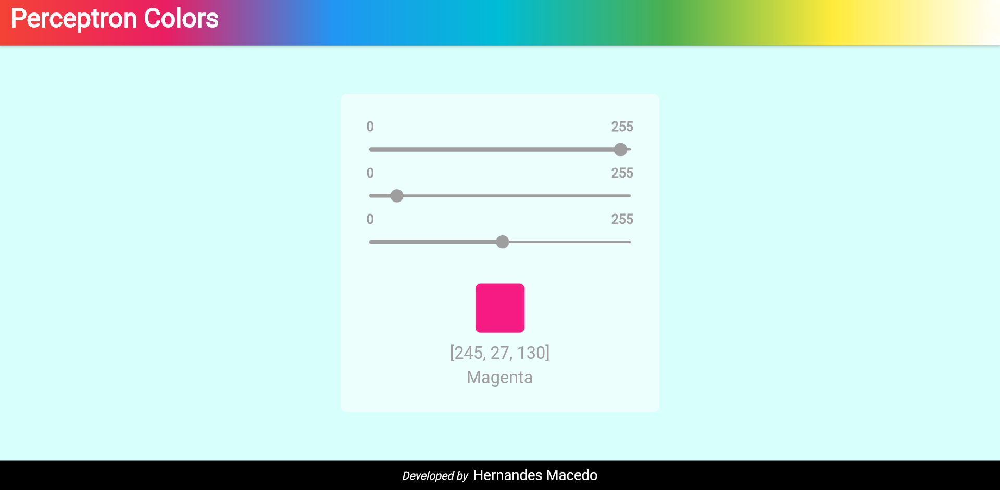

# Perceptron Colors

This is an Artificial Intelligence project that performs a Perceptron algorithm of neural network-supervised learning to classify 8 (eight) different colors out of all possible RGB combinations:

 Red

 Green

 Blue

 Black

 White

 Yellow

 Magenta

 Cyan

## Interface

